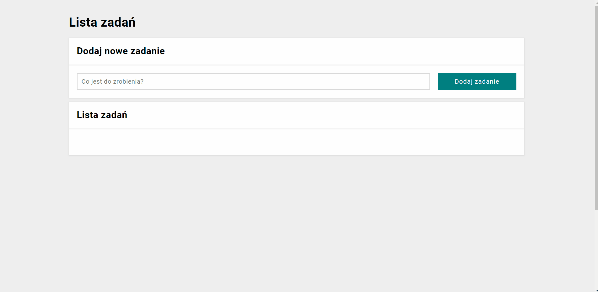

# TO-DO-LIST 📝

## Description

This is simple to-do-list app where you can add and delete tasks from list. Additionally you can mark your task as done when it is done.

## DEMO

You can add your tasks [here](https://hitymek.github.io/todo-list-js/).

## How to use 

1. Enter a task content.
2. Click "Dodaj zadanie" button to add your task to the list of tasks.
3. Now you can add next task in the same way.
4. You can mark your task as done by the click in the green button on the left side of task.
5. In the end when you want delete a task, just click a red button on the right side of task.

## GIF TUTORIAL

## Technologies 🛠

- BEM
- CSS (media-queries, flox-box, grid)
- HTML
- JAVASCRIPT ES6
- Markdown